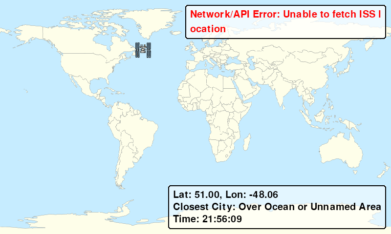
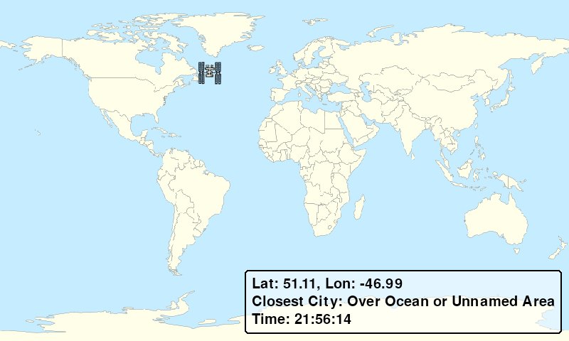

# Raspberry Pi ISS Tracker

A full-screen Raspberry Pi dashboard that displays the **International Space Station’s (ISS) real-time location** on a world map. Shows latitude, longitude, and the nearest city. Developed entirely via SSH and extensively debugged with Gemini AI assistance. This was a **learning project** focused on APIs, Python programming, and working with Raspberry Pi-like single-board computers.


---

## Features

* **Real-Time ISS Location**: Displays ISS latitude and longitude via Open Notify API.
* **Nearest City Detection**: Reverse geocoding (requires an **API key**) to show closest major city.
* **Custom Map Overlay**: ISS icon positioned on a full-world map.
* **Error Handling**: Graceful messages for API or network issues.

---

## Hardware & Software

* **Hardware**

  * Raspberry Pi 4
  * 4-inch **Miuzei HDMI Display-C**

    * Controller: **XPT2046**
    * Drivers downloaded via [LCD-show.tar.gz](http://www.lcdwiki.com/res/RaspDriver/LCD-show.tar.gz)
    * Correct script for installation: `MPI4008-show`
  * 128GB microSD card + power supply
* **Software**

  * Raspberry Pi OS (Debian Bookworm)
  * Python 3 inside a virtual environment (`venv`)
  * Pygame, Requests, evdev (optional)
  * VNC for remote display during testing

---

## Data Sources & APIs

* **ISS Position**: [Open Notify API](http://api.open-notify.org/iss-now.json)
* **Reverse Geocoding**: [Geocode.maps.co](https://geocode.maps.co/) (**requires API key**)
* **World Map**: [Wikimedia Commons – World Location Map](https://upload.wikimedia.org/wikipedia/commons/thumb/a/ac/World_location_map.svg/1024px-World_location_map.svg.png)
* **ISS Icon**: [SVG Repo – International Space Station Icon](https://www.svgrepo.com/svg/440494/international-space-station) (CC Attribution License)

---

## Setup & Run

1. Flash Raspberry Pi OS with Raspberry Pi Imager.
2. SSH into the Pi and create a virtual environment:

   ```bash
   python3 -m venv venv
   source venv/bin/activate
   ```
3. Install dependencies inside the virtual environment:

   ```bash
   pip install pygame requests
   ```
4. Set up the touchscreen:

   ```bash
   wget http://www.lcdwiki.com/res/RaspDriver/LCD-show.tar.gz
   tar -xvzf LCD-show.tar.gz
   cd LCD-show
   sudo ./MPI4008-show
   ```
5. Place `world_map.png` and `iss_icon.png` in the same folder as `iss_tracker.py`.
6. Run the script full-screen:

   ```bash
   DISPLAY=:0 python3 iss_tracker.py
   ```

---

## Development Workflow

1. **Initial Setup**

   * Flash OS, enable SSH and VNC, prepare microSD.
   * Install touchscreen drivers (`MPI4008-show`) for XPT2046 controller.
2. **Virtual Environment**

   * Created a `venv` to isolate Python dependencies.
3. **Map & Icon Integration**

   * Downloaded world map from Wikimedia Commons.
   * Added ISS icon from SVG Repo.
4. **ISS Tracker Script**

   * Developed with Gemini AI assistance for initial code scaffolding.
   * Implemented Pygame full-screen display with latitude, longitude, and nearest city.
5. **API Integration**

   * Integrated Open Notify API for ISS location.
   * Added reverse geocoding for closest city display (**requires API key**).
6. **Debugging & Testing**

   * SSH-only development; tested with VNC before connecting to the small touchscreen.
   * Extensive debugging to fix display refresh, API parsing, and error handling issues.
7. **Final Touches**

   * Removed touchscreen input code (not used).
   * Refined UI: hidden cursor, transparent text box, smaller ISS icon.

---

## Future Touchscreen Plans

The touchscreen may be reused for additional space-related displays in the future, including:

* Real-time **solar activity monitoring**.
* **Satellite tracking** overlays beyond the ISS.
* **Custom astronomy dashboards** for celestial events and passes.
* Interactive **space weather alerts**.

Touchscreen functionality can be added back in to allow swiping between panels and interactive controls without affecting the existing ISS display.

---

## Screenshots

# Error Handling

# No City Nearby


